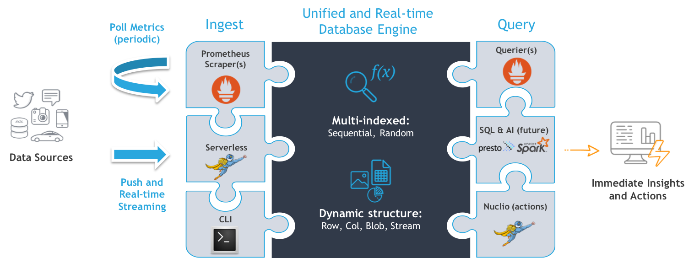
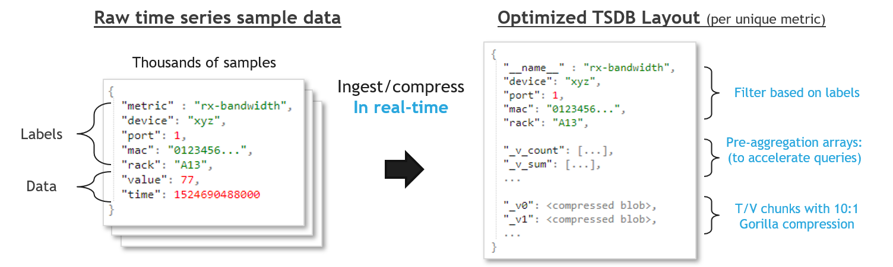

[](https://travis-ci.org/v3io/v3io-tsdb)

# V3IO-TSDB
Iguazio API lib for time-series DB access and Prometheus TSDB storage driver. 

> Note: This project is still under development, it requires the latest 1.7 release of iguazio DB (with Blob functions)

## Overview
Iguazio provides a real-time flexible document database engine which accelerates popular BigData and open-source 
frameworks such as Spark and Presto, as well as provide AWS compatible data APIs (DynamoDB, Kinesis, S3). 

Iguazio DB engine runs at the speed of in-memory databases, but uses lower cost and higher density (NVMe) Flash, it has 
a unique low-level design with highly parallel processing and OS bypass which treats Flash as async memory pages. 

Iguazio DB low-level APIs (v3io) has rich API semantics and multiple indexing types, those allow it to run multiple
workloads and processing engines on exactly the same data, and consistently read/write the data in different tools.

This project uses v3io semantics (row & col layouts, arrays, random & sequential indexes, etc.) to provide extremely 
fast and scalable Time Series database engine which can be accessed simultaneously by multiple engines and APIs, such as:
- [Prometheus](https://prometheus.io/) Time Series DB (for metrics scraping & queries)
- [nuclio](https://github.com/nuclio/nuclio) serverless functions (for real-time ingestion, stream processing or queries) 
- Iguazio DynamoDB API (with extensions) 
- Apache Presto & Spark (future item, for SQL & AI)
- Built-in CLI (tsdbctl) for DB creation, ingestion, and queries 

[nuclio](https://github.com/nuclio/nuclio) supports HTTP and a large variety of streaming/triggering options (Kafka, Kinesis
, Azure event-hub, RabbitMQ, NATS, Iguazio streams, MQTT, Cron tasks), it provides automatic deployment and auto-scaling 
enabling ingestion from variety of sources at endless scalability. using nuclio functions can be customized to pre-process 
incoming data e.g. examine metric data, alert, convert formats, etc.  

<br>


<br>

## Architecture
The solution stores the raw data in highly compressed column chunks (using Gorilla/XOR compression variation), with one 
chunk for every n hours (1hr default), queries will only retrieve and decompress the specific columns based on the 
requested time range. 

Users can define pre-aggregates (count, avg, sum, min, max, stddev, stdvar, last, rate) which use v3io update expressions and store
data consistently in arrays per user defined intervals (RollupMin) and/or dimensions (labels). 



High-resolution queries will detect the pre-aggregates automatically and selectively access the array ranges 
(skip chunk retrieval, decompression, and aggregation) which significantly accelerate searches and provide real-time 
response. an extension supports overlapping aggregates (retrieve last 1hr, 6h, 12hr, 24hr stats in a single request), 
this is currently not possible via the standard Prometheus TSDB API.  

The data can be partitioned to multiple tables (e.g. one per week) or use a cyclic table (goes back to the first chunk after
 it reached the end), multiple tables are stored in a hierarchy under the specified path. 
 
Metric names and labels are stored in search optimized keys and string attributes. Iguazio DB engine can run full 
dimension scan (searches) in the rate of millions of metrics per second, or use selective range based queries to access 
a specific metric family. 

The use of v3io random access keys (Hash based) allow real-time sample data ingestion/retrieval and stream processing. 

To maintain high-performance over low-speed connections we implement auto IO throttling, if the link is slow multiple 
samples will be pushed in a single operation, users can configure the maximum allowed batch (trade efficiency with 
consistency). IO is done using multiple parallel connections/workers enabling maximum throughput regardless of the 
link latency.       

## How To Use  

The code is separated to Prometheus compliant adapter in [/promtsdb](promtsdb) and more generic/advanced adapter in 
[/pkg/tsdb](pkg/tsdb), you should use the latter for custom functions and code. See a full usage example in 
[v3iotsdb_test.go](/pkg/tsdb/v3iotsdb_test.go), both have similar semantics.

For Prometheus you would need to use the fork found in `https://github.com/v3io/prometheus`, it already loads this
library, you would need to place a `v3io-tsdb-config.yaml` file with relevant configuration in the same folder as the Prometheus
executable (see details on configurations below).

A developer using this library should first create a TSDB, this can be done using the CLI or an API call (`CreateTSDB`) 
which builds the TSDB metadata in the DB. To use the DB you should create an Adapter using the method `NewV3ioAdapter()`
, with the adapter he can create an `Appender` for adding samples or `Querier` for querying the database and retrieving 
a set of metrics or aggregates, see the following sections for details.

A user can run the CLI to add (append) or query the DB, to use the CLI, build the code under [tsdbctl](cmd/tsdbctl), 
it has built-in help, see the following add/query examples:

```
	# create a DB with expected ingestion rate of one sample per second and some aggregates (at 30 min interval) 
	tsdbctl create -t <table> --ingestion-rate 1/s -a count,sum,max -i 30m

	# display DB info with metric names (types) 
	tsdbctl info -t <table> -n
	
	# append a sample (73.2) to the specified metric type (cpu) + labels at the current time
	tsdbctl add -t <table> cpu os=win,node=xyz123 -d 73.2
	
	# display all the CPU metrics for win servers from the last hours, in CSV format 
	tsdbctl query -t <table> cpu -f "os=='win'" -l 1h -o csv
	
```

For use with nuclio function you can see function example under [\nuclio](examples/nuclio)

## API Walkthrough 

### Creating and Configuring a TSDB Adapter 

The first step is to create a TSDB, this is done only once per TSDB and generates the required metadata and configuration
such as partitioning strategy, retention, aggregates, etc. this can be done via the CLI or a function call.

```go
	// Load v3io connection/path details (see YAML below)
	v3iocfg, err := config.GetOrLoadFromFile("v3io-tsdb-config.yaml")
	if err != nil {
		// TODO: handle error
	}

	// Specify the default DB configuration (can be modified per partition)
	samplesIngestionRate = "1/s"
	aggregationGranularity = "1h"
	aggregatesList = "scount,avg,min,max"
	schema, err := schema.NewSchema(v3iocfg, samplesIngestionRate, aggregationGranularity, aggregatesList)
	if err != nil {
		// TODO: handle error
	}
	
	return tsdb.CreateTSDB(v3iocfg, schema)
```

> If you plan on using pre-aggregation to speed aggregate queries you should specify the `Rollups` (function list) and 
`RollupMin` (bucket time in minutes) parameters, the supported aggregation functions are: count, sum, avg, min, max, 
stddev, stdvar.

In order to use the TSDB we need to create an adapter, the `NewV3ioAdapter` function accepts 3
parameters: the configuration structure, v3io data container object and logger object. The last 2 are optional, in case
you already have container and logger (when using nuclio data bindings).

Configuration is specified in a YAML or JSON format, and can be read from a file using `config.GetOrLoadFromFile(path string)` 
or can be loaded from a local buffer using `config.GetOrLoadFromData(data []byte)`.
You can see details on the configuration options in the V3IO TSDB [**config.go**](pkg/config/config.go) source file.
A template configuration file is found at **examples/v3io-tsdb-config.yaml.template**.
You can use it as a reference for creating your own TSDB configuration file.
For example:

```yaml
webApiEndpoint: "192.168.1.100:8081"
container: "tsdb"
username: "johnd"
password: "OpenSesame"
```

Following is an example of code for creating an adapter:

```go
	// create configuration object from file
	cfg, err := config.GetOrLoadFromFile("v3io-tsdb-config.yaml")
	if err != nil {
		// TODO: handle error
	}

	// create and start a new TSDB adapter 
	adapter, err := tsdb.NewV3ioAdapter(cfg, nil, nil)
	if err != nil {
		// TODO: handle error
	}
```

### Creating and using an Appender (ingest metrics)

The `Appender` interface is used to ingest metrics data, there are two functions for it: `Add` and `AddFast` which can be
after we used Add (using the refID returned by Add) to reduce some lookup/hash overhead.

Example:

```go
	// create an Appender interface 
	appender, err := adapter.Appender()
	if err != nil {
		panic(err)
	}

	// create metrics labels, `__name__` label specify the metric type (e.g. cpu, temperature, ..)
	// the other labels can be used in searches (filtering or grouping) or aggregations
	// use utils.LabelsFromStrings(s ...string) for string list input or utils.LabelsFromMap(m map[string]string) for map input
	lset := utils.LabelsFromStrings("__name__","http_req", "method", "post")

	// Add a sample with current time (in milisec) and the value of 7.9
	ref, err := appender.Add(lset, time.Now().Unix * 1000, 7.9)
	if err != nil {
		panic(err)
	}

	// Add a second sample using AddFast and the refID from Add
	err := appender.AddFast(nil, ref, time.Now().Unix * 1000 + 1000, 8.3)
	if err != nil {
		panic(err)
	}
```

### Creating and using a Querier (read metrics and aggregates) 

The `Querier` interface is used to query the database and return one or more metrics, we first need to create a `Querier`
and specify the query window (min and max times), once we did we can use `Select()` or `SelectOverlap()` commands which will 
return a list of series (as an iterator object).

Every returned series have two interfaces, `Labels()` which returns the series or aggregate labels, and `Iterator()`
which returns an iterator over the series or aggregate values.

The `Select()` call accepts 4 parameters:
* name (string) - optional, metric type (e.g. cpu, memory, ..), specifying it accelerate performance (use range queries)   
* functions (string) - optional, a comma separated list of aggregation functions e.g. `"count,sum,avg,stddev"`
* step (int64) - optional, the step interval used for the aggregation functions in milisec 
* filter (string) - V3IO GetItems filter string for selecting the desired metrics e.g. `__name__=='http_req'`

using `functions` and `step` is optional, use it only when you are interested in pre-aggregation and the step is >> than 
the sampling interval (and preferably equal or greater than the partition RollupMin interval). when using aggregates it will
return one series per aggregate function, the `Aggregate` label will be added to that series with the function name.

In some cases we would like to retrieve overlapping aggregates instead of fixed interval ones, e.g. stats for last 1hr, 6hr, 24hr
the `SelectOverlap()` call adds the `win` integer array ([]int) which allow specifying the requested windows. the windows are 
multiplied by the step value and start from the querier maxt value e.g. for 1hr, 6hr, and 24hr windows use `Step=3600 * 1000` 
(1hr), `win=[1,6,24]`, and `maxt` should be the current time. The result set (series iterator) in this case will only contain 3 
elements sorted from the oldest to newest (24, 6, 1).

creating a querier:

```go
	qry, err := adapter.Querier(nil, minTime, maxTime)
	if err != nil {
		panic(err)
	}
```

Simple select example (no aggregates):
```go
	set, err := qry.Select("http_req", "", 0, "method=='post'")
```

Select using aggregates:

```go
	set, err := qry.Select("http_req", "count,avg,sum,max", 1000*3600, "method=='post'")
```

Using SelectOverlap (overlapping windows): 

```go
	set, err := qry.SelectOverlap("http_req", "count,avg,sum", 1000*3600, []int{24,6,1}, "method=='post'")
```

Once we obtain a set using one of the methods above we can iterate over the set and the individual series in the following way:

```go
	for set.Next() {
		if set.Err() != nil {
			panic(set.Err())
		}

		series := set.At()
		fmt.Println("\nLables:", series.Labels())
		iter := series.Iterator()
		for iter.Next() {
			if iter.Err() != nil {
				panic(iter.Err())
			}

			t, v := iter.At()
			fmt.Printf("t=%d,v=%.2f ", t, v)
		}
		fmt.Println()
	}
```
